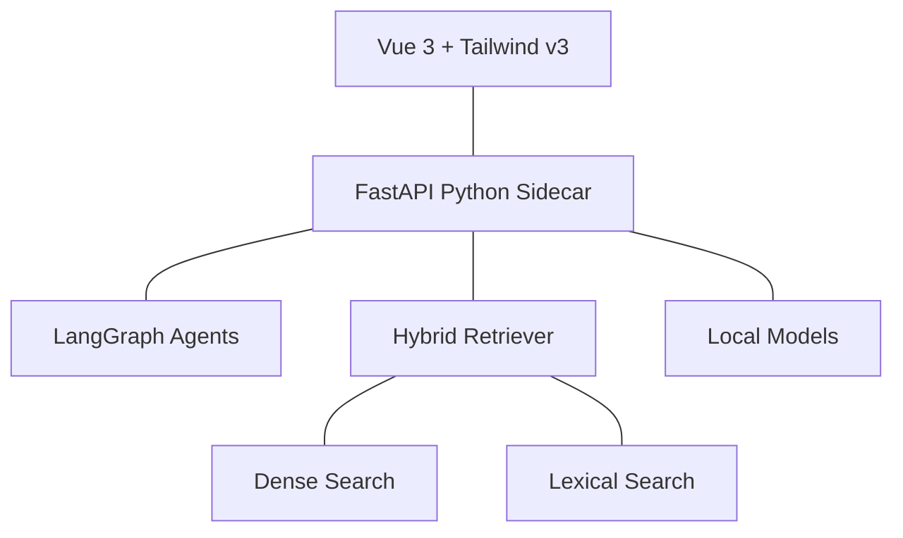

# ContextRefinery 💎
> **The High-Fidelity Context Orchestration Engine**

Transform messy codebases and complex requirements into context-dense, LLM-optimized prompts. Built for engineers who need local-first intelligence with a premium experience.

## ✨ Premium Features

- **Hybrid Retrieval (Dense + Sparse)**: Combines Semantic ChromaDB vector search with BM25 Lexical search for 100% recall.
- **Cross-Encoder Reranking**: Locally loads the `ms-marco-MiniLM-L-6-v2` model for high-precision context selection.
- **Local Model Manager**: Dynamic discovery and streaming downloads for any Ollama model directly from the UI.
- **Refinement Pipeline**: Multi-agent LangGraph orchestration that iteratively optimizes prompts within your token budget.
- **Power-User UX**: Glassmorphism design system, Focus Mode (`Ctrl+B`), and multi-format export (Markdown, XML, JSON).

## 🏗️ Architecture



## 🚀 Quick Start

### 1. Requirements
- **Node.js** ≥ 18 (with pnpm)
- **Python** ≥ 3.11
- **Rust** ≥ 1.77 (with MSVC Build Tools on Windows)
- **Ollama** (optional, for local models) — [ollama.com](https://ollama.com)

### 2. Sidecar Setup
```bash
cd src-backend
python -m venv .venv
# Activate venv
pip install -r requirements.txt
cp .env.example .env # Add your Google/OpenAI keys
python main.py
```

### 3. Frontend Setup
```bash
pnpm install
pnpm tauri dev # Or pnpm dev for web-only
```

## ⚙️ Environment Variables

Located in `src-backend/.env`:
- `GOOGLE_API_KEY`: Required for Gemini (Recommended default).
- `DEFAULT_LLM_PROVIDER`: Set to `ollama` for total local privacy.
- `CHROMA_PERSIST_DIRECTORY`: Default is `~/.context-refinery/chroma`.

## ⌨️ Shortcuts
- `Ctrl + Enter`: Refine Prompt
- `Ctrl + B`: Toggle File Sidebar
- `Ctrl + S`: Settings

## 📜 License
MIT
